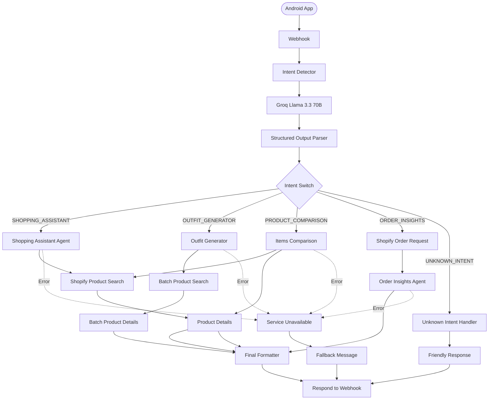

<div align="center">

# 🐫 Qafilah (قافلة)

### *The Next Generation AI-Powered Mobile Commerce Platform*


<br/>

**A modern AI-powered mobile commerce platform built with Kotlin, Jetpack Compose, Shopify GraphQL, Firebase, and Agentic AI automation.**

---

### 🚀 Intelligent Shopping • 🤖 AI Assistant • ⚡ Real-time Sync • 🛍️ Shopify Powered

</div>

---

# 📖 Table of Contents

- [About](#about)
- [Demo](#demo)
- [Features](#features)
- [Screenshots](#screenshots)
- [Technology Stack](#technology-stack)
- [Architecture](#architecture)
- [Project Structure](#project-structure)
- [AI Assistant](#ai-assistant)
- [Installation](#installation)
- [Configuration](#configuration)
- [Roadmap](#roadmap)
- [Contributing](#contributing)
- [License](#license)
- [Author](#author)

---

# About

Qafilah is a **production-ready AI-powered mobile commerce application** inspired by the historical Arabic merchant caravans that connected civilizations through trade.

The application combines modern Android development practices with intelligent automation to deliver a fast, scalable, and personalized shopping experience.

Unlike traditional e-commerce applications, Qafilah integrates **Agentic AI**, allowing users to receive intelligent shopping assistance, outfit recommendations, product comparisons, and order support through natural conversations.

The project follows **Clean Architecture** and **MVI**, ensuring maintainability, scalability, and separation of concerns.

---

# Why Qafilah?

The word **قافلة (Qafilah)** means **Caravan**.

Historically, caravans transported valuable goods across continents while connecting different cultures.

Inspired by this concept, Qafilah connects customers with trending products from around the world through a modern AI-powered shopping experience.

---

# Demo

## Application Preview

> **Coming Soon**

Replace these placeholders with screenshots after uploading them.

| Home | Product | Cart |
|------|---------|------|
|  |  |  |

---

| Wishlist | AI Assistant | Profile |
|-----------|--------------|---------|
|  |  |  |

---

# Features

## Shopping Experience

- Browse products without authentication
- User authentication using Firebase
- Email verification
- Secure login and registration
- Product search
- Product filtering
- Categories & Subcategories
- Brand browsing
- Product variants
- Dynamic pricing
- Product reviews
- Ratings
- Related products
- Recently viewed products
- Best sellers
- Trending products

---

## Cart

- Add to cart
- Remove from cart
- Quantity management
- Inventory validation
- Real-time subtotal
- Shipping calculation
- Taxes
- Checkout validation

---

## Wishlist

- Cloud synchronized wishlist
- Multi-device synchronization
- Instant favorite updates
- Persistent storage

---

## Orders

- Order history
- Order details
- Shipment tracking
- Delivery status
- Payment status

---

## Location

- Google Places API
- HERE Maps Integration
- Address validation
- Saved addresses
- Delivery location selection

---

## Currency

- Live exchange rates
- Multiple currencies
- Automatic conversion

---

## Notifications

- Firebase Cloud Messaging
- Promotional notifications
- Order updates
- Shipping updates

---

## Offline Support

- Graceful offline handling
- Local cache
- Retry mechanism
- Offline mini-game

---

# Special Features

## 🐪 Desert Runner

When the user loses internet connectivity, Qafilah doesn't simply display an error screen.

Instead, users can play an integrated pixel-art mini-game featuring a camel running through the desert while the application waits for the network to reconnect.

This improves engagement and reduces frustration during connectivity interruptions.

---

## 👥 Multi-Account Support

Unlike traditional shopping applications, Qafilah supports multiple user profiles without forcing complete logout cycles.

Each account maintains:

- Wishlist
- Cart
- Settings
- Orders
- Recently viewed products

independently.

---

## 🌍 International Shopping

- Currency conversion
- Localized prices
- International brands
- Multiple payment methods
- Region-aware shopping

---

# Technology Stack

## Android

- Kotlin
- Coroutines
- Flow
- StateFlow
- Jetpack Compose
- Navigation Compose
- ViewModel
- Material 3

---

## Architecture

- Clean Architecture
- MVI
- Repository Pattern
- Use Cases
- SOLID Principles
- Dependency Injection

---

## Backend

- Shopify Storefront API
- GraphQL
- Firebase Authentication
- Firebase Cloud Messaging
- Firebase Realtime Database

---

## AI

- Groq LLM
- n8n Automation
- Agentic AI
- Intent Detection
- Structured Output Parsing
- Product Recommendation Agents
- Outfit Recommendation Agent



---

## Libraries

- Apollo GraphQL
- Coil
- Koin
- Kotlin Serialization
- Firebase SDK
- Material Icons
- Lifecycle Components

---

# Project Highlights

- ✅ Modern Android Development
- ✅ 100% Kotlin
- ✅ Jetpack Compose UI
- ✅ Clean Architecture
- ✅ MVI
- ✅ Shopify GraphQL
- ✅ Firebase Authentication
- ✅ Realtime Database
- ✅ Cloud Messaging
- ✅ AI Shopping Assistant
- ✅ n8n Automation
- ✅ Offline Support
- ✅ Multi-Account Sessions
- ✅ Responsive UI
- ✅ Material Design 3
- ✅ Scalable Codebase

---
---

# 🏗️ Architecture

Qafilah follows **Clean Architecture** with the **MVI** design pattern to ensure maintainability, scalability, and testability.

```
                    Presentation
            (Compose UI + ViewModels)
                     │
                     ▼
                 Domain Layer
          (UseCases + Repository Interfaces)
                     │
                     ▼
                  Data Layer
     (Repository Implementation + Remote APIs)
                     │
                     ▼
      Shopify GraphQL • Firebase • REST APIs
```

Each layer has a single responsibility and communicates only with the adjacent layer.

---

# Clean Architecture

```
┌──────────────────────────────────────────────┐
│                 Presentation                 │
│----------------------------------------------│
│ Screens                                      │
│ Components                                   │
│ Navigation                                   │
│ ViewModels                                   │
│ UI State                                     │
└──────────────────────────────────────────────┘
                    │
                    ▼
┌──────────────────────────────────────────────┐
│                    Domain                    │
│----------------------------------------------│
│ UseCases                                     │
│ Repository Interfaces                        │
│ Models                                       │
│ Business Rules                               │
└──────────────────────────────────────────────┘
                    │
                    ▼
┌──────────────────────────────────────────────┐
│                     Data                     │
│----------------------------------------------│
│ Repository Implementations                   │
│ Remote Data Sources                          │
│ Local Data Sources                           │
│ DTOs                                         │
│ Mappers                                      │
└──────────────────────────────────────────────┘
                    │
                    ▼
             Shopify + Firebase
```

---

# MVI Flow

```
User
 │
 ▼
Composable Screen
 │
 ▼
ViewModel
 │
 ▼
UseCase
 │
 ▼
Repository
 │
 ▼
Remote Data Source
 │
 ▼
GraphQL / Firebase
 │
 ▼
Repository
 │
 ▼
UseCase
 │
 ▼
ViewModel
 │
 ▼
StateFlow
 │
 ▼
Compose UI
```

---

# Project Structure

```
app
│
├── core
│   ├── common
│   ├── model
│   ├── network
│   ├── navigation
│   ├── util
│   ├── currency
│   └── ui
│
├── features
│
│   ├── auth
│   │
│   ├── home
│   │
│   ├── product
│   │
│   ├── cart
│   │
│   ├── wishlist
│   │
│   ├── checkout
│   │
│   ├── orders
│   │
│   ├── profile
│   │
│   ├── ai
│   │
│   └── settings
│
├── di
│
├── graphql
│
└── MainActivity.kt
```

---

# Feature Structure

Every feature follows the exact same architecture.

```
feature

├── data
│   ├── datasource
│   ├── dto
│   ├── mapper
│   ├── repository
│   └── remote
│
├── domain
│   ├── model
│   ├── repository
│   └── usecase
│
└── presentation
    ├── components
    ├── screen
    ├── state
    ├── event
    └── viewmodel
```

---

# Dependency Injection

Qafilah uses **Koin** for dependency injection.

Benefits include:

- Loose coupling
- Easier testing
- Centralized dependency management
- Modular architecture
- Better scalability

Example architecture:

```
App

│

├── NetworkModule

├── RepositoryModule

├── UseCaseModule

├── ViewModelModule
```

---

# State Management

The application uses a unidirectional data flow powered by **StateFlow**.

```
User Action

↓

ViewModel

↓

StateFlow

↓

Composable

↓

UI Update
```

Advantages:

- Reactive UI

- Lifecycle awareness

- No manual callbacks

- Thread-safe

- Easy testing

---

# Repository Pattern

Repositories abstract all data sources.

```
ProductRepository

├── GraphQL

├── Firebase

├── Local Cache

└── Memory Cache
```

The UI never knows where data comes from.

---

# Data Flow

```
UI

↓

ViewModel

↓

UseCase

↓

Repository

↓

Apollo GraphQL

↓

Shopify

↓

Repository

↓

UseCase

↓

ViewModel

↓

StateFlow

↓

Compose UI
```

---

# Shopify Integration

Qafilah communicates directly with the Shopify Storefront API using GraphQL.

Supported operations include:

- Product search

- Collections

- Brands

- Product details

- Variants

- Images

- Reviews

- Cart

- Orders

- Customer accounts

- Inventory

---

# Firebase Services

The application integrates several Firebase products.

| Service | Purpose |
|----------|----------|
| Authentication | Login & Registration |
| Cloud Messaging | Push Notifications |
| Realtime Database | Wishlist Synchronization |
| Analytics | User Insights |
| Crashlytics *(optional)* | Crash Reporting |

---

# Networking

Networking is powered by:

- Apollo GraphQL

- Kotlin Coroutines

- Kotlin Flow

- Repository Pattern

- Safe API Calls

- Result Wrappers

- Exception Handling

---

# Error Handling

Every network request is wrapped using a safe result type.

```
Loading

↓

Success

↓

Error
```

Benefits:

- Consistent UI states

- Easy retries

- Better debugging

- Cleaner ViewModels

---

# Security

Qafilah follows several security best practices.

✔ Firebase Authentication

✔ Email Verification

✔ Secure API Keys

✔ GraphQL Access Tokens

✔ HTTPS Only

✔ Input Validation

✔ Authentication Guards

✔ Protected Wishlist

✔ Protected Orders

✔ Protected Checkout

---

# Performance Optimizations

The application includes numerous optimizations.

- LazyColumn virtualization

- Stable Keys

- Image caching

- GraphQL query optimization

- StateFlow

- Immutable UI state

- Remember blocks

- Derived State

- Efficient recomposition

- Coroutine scopes

- Background loading

- Pagination-ready architecture

---

# Design Principles

The codebase follows:

- SOLID Principles

- DRY

- KISS

- Separation of Concerns

- Single Source of Truth

- Reactive Programming

- Immutable UI State

- Dependency Inversion

---

# Architecture Summary

| Layer | Responsibility |
|--------|----------------|
| Presentation | UI & User Interaction |
| ViewModel | State Management |
| Domain | Business Logic |
| Repository | Data Abstraction |
| Remote | Shopify/Firebase |
| Local | Cache & Preferences |
| Core | Shared Utilities |

---
---

# 🤖 Alhakim — AI Shopping Assistant

One of Qafilah's flagship features is **Alhakim**, an intelligent shopping assistant designed to provide users with a natural, conversational shopping experience.

Unlike traditional chatbots that rely on keyword matching, Alhakim uses an **Agentic AI architecture** powered by **Groq LLM** and orchestrated using **n8n**.

The assistant understands user intent, invokes the appropriate tools, retrieves real-time information from Shopify, and generates context-aware responses.

---

# AI Capabilities

### 🛍️ Smart Product Search

Users can ask:

> *Show me black Nike shoes under $100.*

The assistant:

- Detects the intent
- Extracts filters
- Searches Shopify
- Returns matching products

---

### 👕 Outfit Recommendation

Example:

> I need an outfit for a wedding.

The assistant automatically searches for:

- Shirts
- Pants
- Shoes
- Accessories

and generates a complete outfit recommendation.

---

### ⚖️ Product Comparison

Example:

> Compare the iPhone 15 and Samsung S24.

The assistant retrieves:

- Specifications
- Price
- Availability
- Features

before generating a detailed comparison.

---

### 📦 Order Tracking

Users can ask:

> Where is my order?

The assistant retrieves:

- Order status
- Shipment information
- Estimated delivery
- Payment status

directly from Shopify.

---

### 💬 Shopping Assistant

The assistant also answers:

- Product questions
- Store policies
- Return policy
- Shipping information
- Recommendations
- General shopping inquiries

---

# AI Architecture

```
                User Message
                      │
                      ▼
               n8n Webhook Trigger
                      │
                      ▼
              Intent Detection Agent
               (Groq Llama 3.3 70B)
                      │
        ┌─────────────┼─────────────┐
        ▼             ▼             ▼
 Product Search   Outfit Agent   Order Agent
        │             │             │
        ▼             ▼             ▼
 Shopify API    Shopify API    Shopify API
        │             │             │
        └─────────────┼─────────────┘
                      ▼
              Response Generator
                      │
                      ▼
                   Android App
```

---

# Intent Detection

Every incoming message is classified before execution.

Supported intents include:

| Intent | Description |
|----------|-------------|
| PRODUCT_SEARCH | Search products |
| PRODUCT_DETAILS | Product information |
| PRODUCT_COMPARISON | Compare products |
| OUTFIT_GENERATION | Build an outfit |
| ORDER_STATUS | Track orders |
| SHIPPING | Shipping information |
| RETURNS | Return policy |
| RECOMMENDATION | Personalized suggestions |
| GENERAL | General conversation |

---

# Workflow Pipeline

```
User

↓

Webhook

↓

Groq LLM

↓

Intent Detection

↓

Structured JSON

↓

Tool Selection

↓

Shopify GraphQL

↓

Response Formatting

↓

Android Application
```

---

# n8n Automation

The entire AI system is orchestrated using **n8n**.

Responsibilities include:

- Workflow orchestration
- Intent routing
- Tool execution
- Error handling
- API communication
- Prompt management
- Response formatting

---

# Workflow Overview

```
Webhook
   │
   ▼
Language Detection
   │
   ▼
Intent Classification
   │
   ▼
Switch Node
   │
   ├───────────────┐
   ▼               ▼
Search Tool   Outfit Tool
   │               │
   ▼               ▼
GraphQL       Batch Search
   │               │
   └──────┬────────┘
          ▼
 Response Builder
          │
          ▼
 Android App
```

---

# Structured Output

Instead of relying on plain text, the LLM returns structured JSON.

Example:

```json
{
  "intent": "PRODUCT_SEARCH",
  "language": "en",
  "confidence": 0.98,
  "filters": {
    "brand": "Nike",
    "color": "Black",
    "maxPrice": 100
  }
}
```

This makes downstream automation reliable and deterministic.

---

# Tool Calling

Depending on the detected intent, the workflow dynamically invokes the required tool.

Available tools include:

- Shopify Product Search
- Product Details
- Batch Product Search
- Order Lookup
- Customer Information
- Product Comparison
- Outfit Generator

---

# Shopify GraphQL Integration

Every AI response is grounded in live data retrieved from the Shopify Storefront API.

The assistant can access:

- Products
- Variants
- Collections
- Inventory
- Pricing
- Images
- Availability
- Customer Orders

This ensures responses remain accurate and up to date.

---

# Multilingual Support

Alhakim supports both:

- 🇺🇸 English
- 🇪🇬 Arabic

The workflow automatically detects the language and responds accordingly.

---

# Error Recovery

To improve reliability, every workflow includes fallback paths.

Possible scenarios include:

- Invalid products
- Network failures
- Shopify downtime
- Empty search results
- Unsupported requests

Instead of failing, the assistant returns a friendly and informative response.

---

# AI Features

- Intent Detection
- Tool Calling
- Structured Output Parsing
- Product Recommendation
- Outfit Generation
- Product Comparison
- Order Tracking
- Multilingual Conversations
- Context Awareness
- Live Shopify Data
- n8n Workflow Automation
- Groq LLM Integration

---

# AI Technology Stack

| Component | Technology |
|-----------|------------|
| Workflow Engine | n8n |
| Language Model | Groq Llama 3.3 70B |
| Automation | n8n |
| API | Shopify Storefront GraphQL |
| Authentication | Firebase Authentication |
| Communication | HTTP Requests |
| Response Format | Structured JSON |

---

# Why Agentic AI?

Unlike a traditional chatbot, Alhakim doesn't just generate text—it performs tasks.

It can:

- Understand user intent
- Choose the correct tool
- Query live Shopify data
- Combine multiple API responses
- Reason over the retrieved information
- Generate accurate, personalized answers

This makes Alhakim an **AI agent** rather than a simple conversational assistant.

---
---

# 🚀 Installation

## Prerequisites

Before running the project, ensure you have the following installed:

| Software | Version |
|----------|----------|
| Android Studio | Narwhal / Ladybug or newer |
| JDK | 17+ |
| Android SDK | API 24+ |
| Kotlin | 2.x |
| Gradle | Latest |
| Git | Latest |

---

# Clone the Repository

```bash
git clone https://github.com/YOUR_USERNAME/Qafilah.git
```

```bash
cd Qafilah
```

---

# Open the Project

Open **Android Studio**

```
File
    └── Open
            └── Qafilah
```

Wait until Gradle finishes syncing.

---

# Environment Configuration

The project uses secrets stored locally.

Create a file named

```
local.properties
```

inside the project root.

Example:

```properties
SHOPIFY_HOST=your-store.myshopify.com

SHOPIFY_STOREFRONT_TOKEN=xxxxxxxxxxxxxxxxxxxxxxxx

N8N_WEBHOOK=https://your-domain.com/webhook/qafilah

GOOGLE_MAPS_KEY=xxxxxxxxxxxxxxxx

HERE_API_KEY=xxxxxxxxxxxxxxxx
```

⚠ Never commit this file.

---

# Firebase Setup

Create a Firebase project.

Enable:

- Authentication
- Realtime Database
- Cloud Messaging

Download

```
google-services.json
```

Place it inside

```
app/
```

Your structure should become

```
app
│
├── google-services.json
│
├── src
├── build.gradle.kts
└── ...
```

---

# Authentication Providers

Enable any providers you need.

Recommended:

- Email & Password
- Google
- Anonymous (optional)

---

# Shopify Configuration

Create a Shopify Store.

Generate a Storefront Access Token.

Copy:

- Store URL
- Storefront Token

into

```
local.properties
```

Example

```properties
SHOPIFY_HOST=myshop.myshopify.com

SHOPIFY_STOREFRONT_TOKEN=xxxxxxxx
```

---

# GraphQL Schema

Apollo automatically generates Kotlin classes from GraphQL queries.

Project structure:

```
graphql

└── storefront

      GetProducts.graphql

      GetCollections.graphql

      SearchProducts.graphql

      GetProduct.graphql

      GetOrders.graphql

      ...
```

Whenever you add a new query simply rebuild the project.

Apollo generates all models automatically.

---

# n8n Setup

Import the provided workflow.

```
Qafilah.json
```

into your n8n workspace.

After importing:

Configure:

- Groq API Key
- Shopify Token
- Shopify Host
- Webhook URL

Activate the workflow.

Copy the webhook URL.

Add it to

```
local.properties
```

Example

```properties
N8N_WEBHOOK=https://your-domain.com/webhook/qafilah
```

---

# Building the Project

Debug

```bash
./gradlew assembleDebug
```

Release

```bash
./gradlew assembleRelease
```

Run

```bash
./gradlew installDebug
```

---

# Running

Press

```
▶ Run
```

inside Android Studio.

Or

```bash
./gradlew installDebug
```

---

# Build Variants

Supported variants

```
debug

release
```

Future variants

```
development

staging

production
```

---

# Dependency Injection

The application uses **Koin**.

Modules include

```
NetworkModule

RepositoryModule

UseCaseModule

ViewModelModule
```

All dependencies are injected automatically.

---

# API Services

The application communicates with several external services.

| Service | Purpose |
|----------|----------|
| Shopify GraphQL | Products |
| Firebase Auth | Authentication |
| Firebase Realtime DB | Wishlist |
| Firebase Cloud Messaging | Notifications |
| Google Places | Addresses |
| HERE Maps | Maps |
| Exchange Rate API | Currency |
| n8n | AI Automation |
| Groq | LLM |

---

# Application Flow

```
Launch App

↓

Splash

↓

Authentication Check

↓

Home

↓

Browse Products

↓

Product Details

↓

Cart

↓

Checkout

↓

Orders

↓

Profile
```

---

# Authentication Flow

```
User

↓

Login Screen

↓

Firebase Authentication

↓

Email Verification

↓

Home Screen
```

Guest users bypass login until checkout or wishlist actions require authentication.

---

# Shopping Flow

```
Home

↓

Collections

↓

Products

↓

Product Details

↓

Add to Cart

↓

Checkout

↓

Payment

↓

Order Confirmation
```

---

# Wishlist Flow

```
Product

↓

Favorite Button

↓

Firebase Database

↓

Cloud Sync

↓

Other Devices
```

---

# AI Assistant Flow

```
User

↓

Chat Screen

↓

Webhook

↓

n8n

↓

Groq

↓

Shopify

↓

Response

↓

Compose UI
```

---

# Offline Mode

When internet connectivity is unavailable:

- Product cache remains available
- Cart persists locally
- Wishlist synchronizes when online
- Requests retry automatically
- Users can enjoy the built-in **Desert Runner** mini-game while waiting for reconnection

---

# Performance

The project is optimized using:

- Coroutines
- StateFlow
- Immutable UI State
- Lazy Lists
- Stable Keys
- Image Caching
- GraphQL Query Optimization
- Efficient Recomposition
- Remember Blocks
- Derived State

---

# Testing

Recommended testing stack

### Unit Testing

- JUnit
- MockK
- Repository Testing


---

# Code Style

The project follows:

- Kotlin Coding Conventions
- Material Design 3
- Clean Architecture
- SOLID Principles
- MVI
- Repository Pattern
- Dependency Injection
- Single Source of Truth

---

# Troubleshooting

## Gradle Sync Failed

Try

```bash
./gradlew clean
```

Then

```bash
./gradlew build
```

---

## GraphQL Classes Missing

Rebuild the project.

Apollo generates the required classes automatically.

---

## Firebase Login Issues

Verify:

- SHA-1 fingerprint
- google-services.json
- Authentication provider
- Package name

---

## AI Assistant Not Responding

Check:

- n8n workflow is active
- Groq API key
- Webhook URL
- Internet connection

---

# Recommended Folder Structure

```
app
│
├── core
├── di
├── features
├── graphql
├── ui
├── MainActivity.kt
│
└── build.gradle.kts
```

---

> 💡 **Tip:** Use the latest stable Android Studio and keep your GraphQL schema in sync whenever Shopify APIs change.

--

# 🤝 Contributing

Contributions are welcome!

If you'd like to improve Qafilah, feel free to:

1. Fork the repository.
2. Create a feature branch.

```bash
git checkout -b feature/amazing-feature
```

3. Commit your changes.

```bash
git commit -m "Add amazing feature"
```

4. Push your branch.

```bash
git push origin feature/amazing-feature
```

5. Open a Pull Request.

Please follow the existing architecture and coding style when contributing.

---

# 📊 Project Statistics

| Metric | Status |
|----------|---------|
| Language | Kotlin |
| UI Toolkit | Jetpack Compose |
| Architecture | Clean Architecture |
| Pattern | MVI |
| Backend | Shopify |
| API | GraphQL |
| Authentication | Firebase |
| AI | Groq + n8n |
| Minimum SDK | 24 |
| Target SDK | 36 |

---

# 🏆 Highlights

✔ 100% Kotlin

✔ Jetpack Compose

✔ Material 3

✔ Clean Architecture

✔ MVI

✔ Repository Pattern

✔ GraphQL

✔ Firebase

✔ Koin Dependency Injection

✔ StateFlow

✔ Coroutines

✔ Agentic AI

✔ Shopify Integration

✔ Push Notifications

✔ Multi-Account Sessions

✔ Offline Support

✔ Currency Conversion

✔ Pixel-Art Mini Game

---

# 📸 Screenshots

> Replace these placeholders with actual screenshots.

| Home | Product | Cart |
|------|----------|------|
|  |  |  |

| Wishlist | AI Assistant | Profile |
|-----------|-------------|----------|
|  |  |  |

---

# 🎥 Demo

You can also include a GIF or screen recording.

```text
demo.gif
```

or

```
https://youtu.be/your-demo-video
```

---

# 📁 Repository Structure

```
Qafilah

├── app
├── core
├── features
├── graphql
├── di
├── screenshots
├── docs
├── README.md
├── LICENSE
└── .gitignore
```

---

# 📄 License

This project is licensed under the **MIT License**.

Feel free to use, modify, and distribute this project in accordance with the license terms.

See the `LICENSE` file for more information.

---

# 🙏 Acknowledgements

Special thanks to the amazing technologies and communities that made this project possible.

- JetBrains
- Google Android Team
- Shopify
- Firebase
- Apollo GraphQL
- Koin
- Groq
- n8n
- Material Design Team
- Open Source Community

---

# 👨‍💻 Authors

## Mahmoud Tarek, Ahmed Haitham, Alaa Hany, Fatema Emara


# ⭐ Support

If you found this project helpful:

- ⭐ Star this repository
- 🍴 Fork the project
- 🛠️ Open an issue if you find a bug
- 💡 Suggest new features
- 📢 Share it with others

Your support helps improve the project and motivates future development.

---

<div align="center">

## 🐫 Qafilah

### *Connecting people with the world's best products through intelligent commerce.*

Built with ❤️ using

**Kotlin • Jetpack Compose • Shopify GraphQL • Firebase • Groq • n8n**

---

### ⭐ If you enjoyed this project, don't forget to leave a Star!

</div>

> ⭐ If you like this project, don't forget to give it a **Star** on GitHub!
